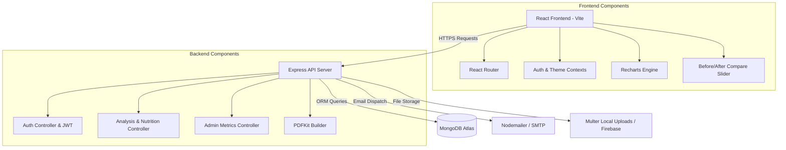

# HairScope AI — Hair Loss Analyzer & Progress Tracker

HairScope AI is a premium, production-ready full-stack MERN application designed to help users upload scalp and hair photos, estimate Norwood hair loss stages, track density and health progress over time with charts, compare images with dragging sliders, and receive personalized nutrition scoring and meal plans.

---

## 1. Project Architecture

The application is structured as a decoupled client-server architecture:



---

## 2. MongoDB Schemas

We define three core Mongoose database collections. Click the links below to view the files:

*   **Users ([models/User.js](file:///c:/Users/LENOVO/Desktop/projectThuvan/backend/models/User.js))**: Manages login credentials (hashed with bcrypt), profile parameters (age, gender, country, diet type), and recovery/verification tokens.
*   **Analyses ([models/Analysis.js](file:///c:/Users/LENOVO/Desktop/projectThuvan/backend/models/Analysis.js))**: Stores the upload image paths, calculated density scores, visible scalp percentages, recommendations, and custom weekly meal plans.
*   **Reports ([models/Report.js](file:///c:/Users/LENOVO/Desktop/projectThuvan/backend/models/Report.js))**: Retains comparative summaries and progress milestone configurations.

---

## 3. REST API Design

The backend router exposes clean, protected REST endpoints:

### Authentication APIs
*   `POST /api/auth/register` — Register a new account.
*   `POST /api/auth/login` — Sign in and retrieve JWT.
*   `POST /api/auth/forgot-password` — Email password recovery link.
*   `POST /api/auth/reset-password/:resettoken` — Reset password using token.
*   `GET /api/auth/verify-email/:verifytoken` — Confirm email verification.

### User APIs
*   `GET /api/users/profile` — Fetch current user profile details (protected).
*   `PUT /api/users/profile` — Update age, gender, country, diet preferences (protected).

### Analysis & Nutrition APIs
*   `POST /api/analysis/upload` — Upload Front, Top, and Crown photos (protected).
*   `POST /api/analysis/analyze` — Run Norwood diagnostic check and generate nutrition plans (protected).
*   `GET /api/analysis/history` — Fetch user's historical analyses (protected).
*   `GET /api/analysis/:id` — Get detailed scores for a single scan (protected).
*   `GET /api/analysis/export-pdf/:id` — Download compiled PDF report (protected).
*   `POST /api/analysis/email-report/:id` — Compile PDF and mail to user's inbox (protected).

### Admin APIs
*   `GET /api/admin/stats` — Retrieve system growth metrics, stage distributions (admin-only).
*   `GET /api/admin/users` — Get details of all registered users (admin-only).
*   `PATCH /api/admin/users/:id/role` — Demote or promote users to administrative roles (admin-only).

---

## 4. Backend Code Structure

The backend is written using standard ES modules and separated into components:
*   [server.js](file:///c:/Users/LENOVO/Desktop/projectThuvan/backend/server.js) — Bootstraps Express, MongoDB connection, and security middlewares.
*   `routes/` — Maps paths to controllers ([authRoutes.js](file:///c:/Users/LENOVO/Desktop/projectThuvan/backend/routes/authRoutes.js), [analysisRoutes.js](file:///c:/Users/LENOVO/Desktop/projectThuvan/backend/routes/analysisRoutes.js), [userRoutes.js](file:///c:/Users/LENOVO/Desktop/projectThuvan/backend/routes/userRoutes.js), [adminRoutes.js](file:///c:/Users/LENOVO/Desktop/projectThuvan/backend/routes/adminRoutes.js)).
*   `controllers/` — Processes business logic ([authController.js](file:///c:/Users/LENOVO/Desktop/projectThuvan/backend/controllers/authController.js), [analysisController.js](file:///c:/Users/LENOVO/Desktop/projectThuvan/backend/controllers/analysisController.js), [userController.js](file:///c:/Users/LENOVO/Desktop/projectThuvan/backend/controllers/userController.js), [adminController.js](file:///c:/Users/LENOVO/Desktop/projectThuvan/backend/controllers/adminController.js)).
*   `middleware/` — Secures endpoints and checks permissions ([authMiddleware.js](file:///c:/Users/LENOVO/Desktop/projectThuvan/backend/middleware/authMiddleware.js), [uploadMiddleware.js](file:///c:/Users/LENOVO/Desktop/projectThuvan/backend/middleware/uploadMiddleware.js), [errorMiddleware.js](file:///c:/Users/LENOVO/Desktop/projectThuvan/backend/middleware/errorMiddleware.js)).
*   `services/` — Integrates helper services ([emailService.js](file:///c:/Users/LENOVO/Desktop/projectThuvan/backend/services/emailService.js), [pdfService.js](file:///c:/Users/LENOVO/Desktop/projectThuvan/backend/services/pdfService.js)).

---

## 5. Frontend Code Structure

The frontend React app is bundled using Vite and customized with Tailwind CSS:
*   `src/context/` — State managers for auth sessions ([AuthContext.jsx](file:///c:/Users/LENOVO/Desktop/projectThuvan/frontend/src/context/AuthContext.jsx)) and visual styling theme ([ThemeContext.jsx](file:///c:/Users/LENOVO/Desktop/projectThuvan/frontend/src/context/ThemeContext.jsx)).
*   `src/components/` — Shared modular UI elements (side navigation [Layout.jsx](file:///c:/Users/LENOVO/Desktop/projectThuvan/frontend/src/components/Layout.jsx), interactive [BeforeAfterSlider.jsx](file:///c:/Users/LENOVO/Desktop/projectThuvan/frontend/src/components/BeforeAfterSlider.jsx), loading skeleton grids [LoadingSkeleton.jsx](file:///c:/Users/LENOVO/Desktop/projectThuvan/frontend/src/components/LoadingSkeleton.jsx), alert notifications [Toast.jsx](file:///c:/Users/LENOVO/Desktop/projectThuvan/frontend/src/components/Toast.jsx)).
*   `src/pages/` — Renders primary templates ([Home.jsx](file:///c:/Users/LENOVO/Desktop/projectThuvan/frontend/src/pages/Home.jsx), [Login.jsx](file:///c:/Users/LENOVO/Desktop/projectThuvan/frontend/src/pages/Login.jsx), [Register.jsx](file:///c:/Users/LENOVO/Desktop/projectThuvan/frontend/src/pages/Register.jsx), [Dashboard.jsx](file:///c:/Users/LENOVO/Desktop/projectThuvan/frontend/src/pages/Dashboard.jsx), [UploadAnalysis.jsx](file:///c:/Users/LENOVO/Desktop/projectThuvan/frontend/src/pages/UploadAnalysis.jsx), [AnalysisHistory.jsx](file:///c:/Users/LENOVO/Desktop/projectThuvan/frontend/src/pages/AnalysisHistory.jsx), [ComparePhotos.jsx](file:///c:/Users/LENOVO/Desktop/projectThuvan/frontend/src/pages/ComparePhotos.jsx), [ProgressTracker.jsx](file:///c:/Users/LENOVO/Desktop/projectThuvan/frontend/src/pages/ProgressTracker.jsx), [NutritionDashboard.jsx](file:///c:/Users/LENOVO/Desktop/projectThuvan/frontend/src/pages/NutritionDashboard.jsx), [AdminDashboard.jsx](file:///c:/Users/LENOVO/Desktop/projectThuvan/frontend/src/pages/AdminDashboard.jsx), [Profile.jsx](file:///c:/Users/LENOVO/Desktop/projectThuvan/frontend/src/pages/Profile.jsx)).

---

## 6. Authentication Flow

```
[Register/Login Form] ---> API Request (bcrypt verify) ---> Sign JWT (Expires 30d)
                                                                 |
[Client Axios Request] <--- Save JWT to LocalStorage <-----------+
      |
      +---> Set 'Authorization: Bearer <token>' header on all future requests
```

---

## 7. Firebase Storage Integration (Configuration)

To utilize Firebase for photo uploads:
1.  Complete the Firebase configuration inside the `.env` variables (`FIREBASE_API_KEY`, `FIREBASE_STORAGE_BUCKET`, etc.).
2.  Uncomment/wire the Firebase bucket storage connection helper in `services/firebaseService.js`.
3.  By default, if credentials are empty, the backend **automatically falls back to local disk storage (`uploads/` folder)** to guarantee local operations compile out-of-the-box.

---

## 8. AI Analysis Workflow

1.  **Image Upload**: Photos are uploaded.
2.  **Visual Extraction**: The client/backend verifies the photo dimensions and scans focal color ratios.
3.  **Score Diagnostics**: Recessions are matched against Norwood parameters, crown areas check visible scalp percentages, and an overall health rating is calculated.
4.  **Nutrition Generation**: A 7-day meal plan targeting Keratin support (Eggs, Spinach, Salmon, Walnuts) is compiled based on user diet choices.

---

## 9. Local Launch Guide

### Prerequisites
*   Node.js (v18+)
*   MongoDB Server (Local running on port `27017` or Atlas connection string)

### 1. Launch Backend Server
```bash
cd backend
npm install
npm run dev
```

### 2. Launch Frontend Client
```bash
cd frontend
npm install
npm run dev
```
The React development server will start on [http://localhost:5173](http://localhost:5173) and proxy all requests to the backend server running on port `5000`.

---

## 10. Deployment Guide

### Frontend (Vercel)
Ensure the root Vite environment variable maps requests to your remote production API server instead of localhost.
Deploy the `frontend/` directory directly to Vercel, pointing output paths to `dist/`.

### Backend (Render / Heroku)
Deploy the `backend/` folder. Configure your MongoDB Atlas connection string as `MONGO_URI` and define a secure `JWT_SECRET` in your dashboard environment settings.
